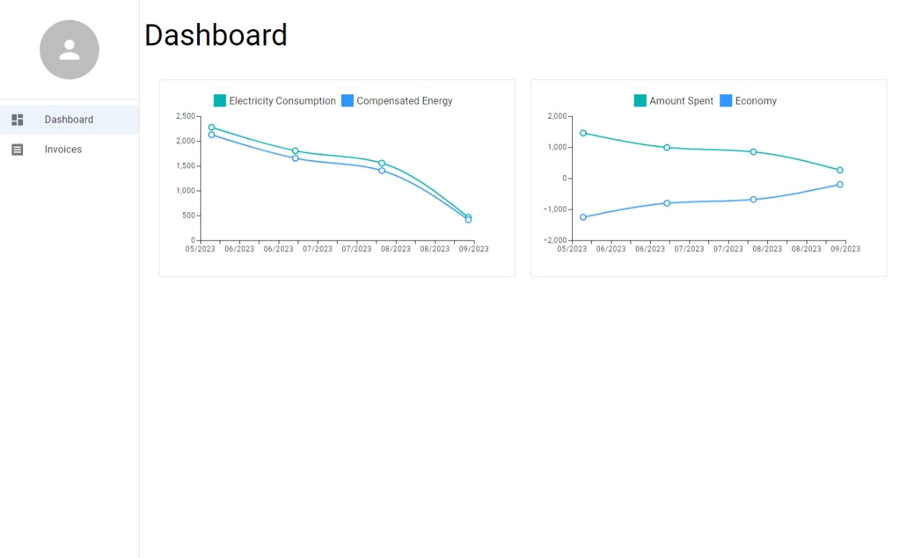
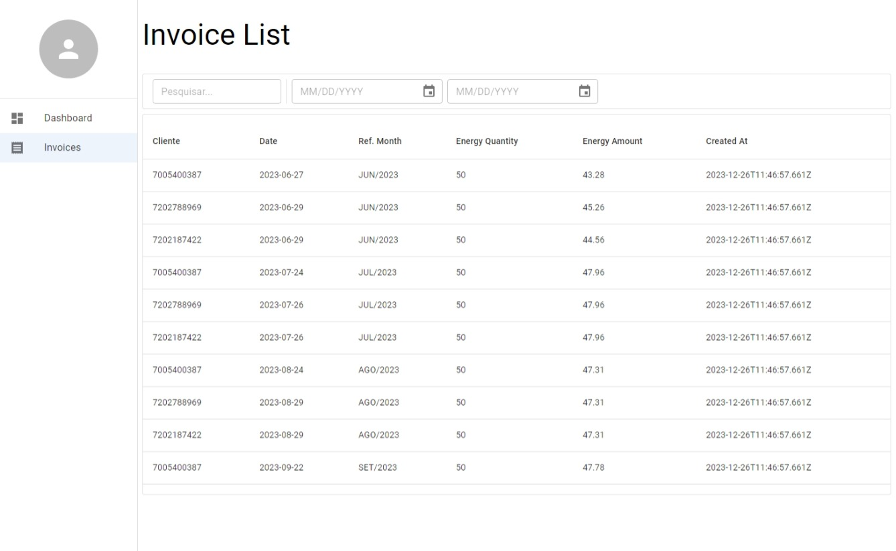

# Teste Desenvolvedor Full Stack - Lumi

O projeto `Lumi Front` é uma Dashboard em React que interage com a API do projeto `Lumi`.

## **Monorepo e Projetos Relacionados**

- **[Monorepo Lumi Challenge](https://github.com/miguelsmuller/lumi-challenge)**
  
- **[Lumi Extraction](https://github.com/miguelsmuller/lumi-extraction)**

- **[Lumi Back](https://github.com/miguelsmuller/lumi-back)**

## **Aspectos Técnicos**

Os detalhes completos do desafio, incluindo especificações para o projeto do front-end, estão disponíveis no PDF do monorepo. Você pode acessar o PDF através do link abaixo:

- **[Detalhes do Desafio - Lumi Challenge](https://github.com/miguelsmuller/lumi-challenge/blob/e8622d0e399c3e2c4802c0c3a1911dc5d86953a8/docs/Teste%20Pr%C3%A1tico%20-%20Dev%20Full%20Stack%20-%20Lumi.pdf)**


## **Estrutura do Projeto**
```
.
├── docs/
├── public/
├── src/
│   ├── pages/
│   │   ├── dashboard/
│   │   └── invoices/
│   ├── shared/
│   │   ├── components/
│   │   │   ├── side-menu/
│   │   │   └── tool-bar/
│   │   ├── contexts/
│   │   ├── environment/
│   │   ├── layouts/
│   │   └── services/
│   ├── routes/
│   ├── react-app-env.d.ts
│   ├── App.tsx
│   └── index.tsx
├── .editorconfig
├── .gitignore
├── package.json
├── tsconfig.json
├── Makefile
├── Dockerfile
└── README.md
```


## **Scripts do Projeto**

- **`npm run start`**: Inicia o servidor de desenvolvimento da aplicação React.

- **`npm run build`**: Gera uma build de produção da aplicação, pronta para ser colocada em um servidor web.

- **`npm run test`**: Executa os testes unitários da aplicação.

- **`npm run lint`**: Executa o linter ESLint para verificar e corrigir problemas no código JavaScript/TypeScript.

### **Makefile**

Adicionalmente aos comando acima esse projeto também possui um Makefile com os seguintes alvos:

- **`make build-image`**: Constrói uma imagem Docker para o projeto.

- **`make run-image`**: Inicia um contêiner Docker com o projeto em execução.

- **`make stop-image`**: Para e remove o contêiner Docker do projeto.

- **`make tag-image`**: Adiciona uma tag à imagem Docker.

- **`make publish-image`**: Publica a imagem Docker em um registro (é necessário configurar o registro).


## **Rodando Localmente**

Para executar o front-end localmente, siga os passos abaixo:

1. Certifique-se de ter a API do **[Lumi Back](https://github.com/miguelsmuller/lumi-back)** em execução.

2. Configuração do Arquivo `.env`:
   - Copie o arquivo `.env.example` para `.env`:
    ```bash
    cp .env.example .env
    ```

   - Preencha as variáveis de ambiente conforme necessário no arquivo `.env`.

3. Instale as dependências:
```bash
npm install
```

4. Inicie o front-end em modo de desenvolvimento:
```bash
npm run start
```

### **Rodando a versão buildada**

1. Primeiro, instale o pacote `serve` globalmente (caso ainda não tenha instalado):

```bash
npm install -g serve
```

2. Em seguida, navegue até a pasta `build` do projeto e execute:
```bash
serve -s build
```

Isso permitirá que você sirva a versão otimizada do projeto React localmente.

## **Screenshot**

### **Dashboard Screenshot**


### **Invoice List Screenshot**


